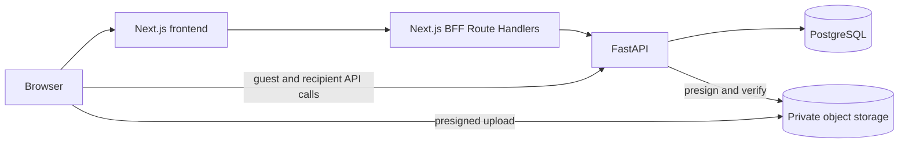

# SafeDrop

SafeDrop is a full-stack application for sharing temporary text and files through expiring, view-limited links.

## Overview

A Drop combines a message, optional attachments, an expiration time, and a recipient view limit. Anyone can create a short-lived guest Drop without an account. Registered users receive longer limits, multi-file uploads, a dashboard, recoverable share links, storage reporting, and controls to update or revoke their own Drops.

SafeDrop also includes an administrator experience for platform statistics, physical storage usage, and user management. The repository represents a completed project implementation, not a claim that a public commercial service is currently deployed.

## Key features

### Temporary sharing

- Expiration-based availability, configurable for up to 30 days for account Drops
- Recipient view limits and atomic view consumption
- Owner revocation and lifecycle filtering for active, expired, consumed, and revoked Drops
- Recipient responses that do not distinguish an unknown token from an unavailable Drop

### Account experience

- Public registration and login for `client` accounts
- Dashboard, searchable Drop history, Drop editing, share-link recovery, and revocation
- Profile editing and active-storage usage reporting
- `admin` dashboards for user management, Drop statistics, and platform storage

### Guest experience

- No account required
- Drops expire within one hour and allow up to three recipient views
- A separate guest management token authorizes the optional file-upload flow

### File sharing

- Private, S3-compatible object storage
- Direct browser uploads using five-minute presigned POSTs
- Backend verification and promotion from a pending key to a final key
- Five-minute presigned recipient download URLs

### Security controls

- Recommended password hashing through `pwdlib`
- Signed JWT access tokens and rotating, database-backed refresh tokens
- HttpOnly cookies managed through the Next.js backend-for-frontend (BFF)
- Backend ownership, role, lifecycle, and quota checks
- Hashed share-token lookup and hashed guest management tokens
- Same-origin checks for BFF mutations

## Tech stack

| Area     | Technologies                                                                                                                                     |
| -------- | ------------------------------------------------------------------------------------------------------------------------------------------------ |
| Frontend | Next.js 16 App Router, React 19, TypeScript, Tailwind CSS 4, shadcn/ui with Base UI, TanStack Query, React Hook Form, Zod, next-themes, Recharts |
| Backend  | FastAPI, Pydantic, SQLAlchemy 2, Alembic, PostgreSQL, psycopg, PyJWT, pwdlib                                                                     |
| Storage  | Neon Object Storage configuration and the S3-compatible `boto3` API                                                                              |
| Tooling  | pnpm workspace, ESLint, Prettier, Ruff, pytest, Husky, lint-staged                                                                               |

## Architecture



Authenticated browser operations use same-origin Next.js Route Handlers. The BFF keeps access and refresh credentials in HttpOnly cookies, forwards bearer access tokens to FastAPI, and refreshes an expired session when possible. Guest creation and recipient access use the browser-reachable FastAPI URL directly.

File bytes do not pass through Next.js or FastAPI during upload. FastAPI authorizes and reserves an upload, the browser sends the file directly to object storage, and FastAPI verifies the stored object before finalizing it. FastAPI remains the source of truth for authentication, authorization, ownership, roles, quotas, and Drop lifecycle rules.

See [Architecture](docs/architecture.md) for request and upload sequences.

## Authentication overview

Next.js owns the `safedrop_access_token` cookie. FastAPI issues the `refresh_token` cookie, which Next.js forwards to and from the browser. Both are HttpOnly; the access JWT is not stored in `localStorage` or returned to application JavaScript by the BFF. FastAPI still validates every bearer token and enforces authorization independently of frontend routing.

See [Authentication](docs/authentication.md) for registration, refresh rotation, logout, and role protection.

## Repository structure

```text
safedrop/
├── backend/
│   ├── alembic/              # Database migrations
│   ├── app/                  # FastAPI app, models, routers, and services
│   ├── tests/                # API and storage integration tests
│   ├── unit_tests/           # Focused backend unit tests
│   └── requirements.txt
├── frontend/
│   ├── app/                  # App Router pages and BFF Route Handlers
│   ├── components/           # Product and UI components
│   ├── hooks/                # TanStack Query hooks and query keys
│   └── lib/                  # API clients, auth, and server helpers
├── docs/                     # Project documentation
├── package.json              # Root development orchestration
└── pnpm-workspace.yaml
```

## Getting started

Install the JavaScript and Python dependencies, configure the provided backend and frontend environment examples, apply migrations, then run:

```powershell
pnpm install
pnpm dev
```

The combined root command expects the backend virtual environment at `backend\.venv` and currently invokes its Windows Python executable. It starts FastAPI first, waits for `http://127.0.0.1:8000/health`, and then starts Next.js. The services can also be run independently:

```powershell
pnpm dev:backend
pnpm dev:frontend
```

For environment variables, Python setup, cross-platform backend commands, database setup, and local URLs, see [Getting started](docs/getting-started.md).

## Documentation

- [Architecture](docs/architecture.md) — system boundaries and request sequences
- [Getting started](docs/getting-started.md) — local setup, configuration, migrations, and startup
- [Authentication](docs/authentication.md) — cookies, JWTs, refresh rotation, roles, and guest capabilities
- [Drops and sharing](docs/drops-and-sharing.md) — domain model, lifecycle, access behavior, and limits
- [File storage](docs/file-storage.md) — reservations, direct uploads, quotas, and cleanup semantics
- [Frontend](docs/frontend.md) — App Router, BFF, TanStack Query, forms, and design conventions
- [API](docs/api.md) — human-readable FastAPI endpoint overview
- [Testing](docs/testing.md) — automated checks and a manual verification checklist
- [Deployment](docs/deployment.md) — production services, variables, CORS, cookies, and migrations

## Security note

SafeDrop uses transport security when deployed behind HTTPS, private object storage, password and capability-token hashing, HttpOnly authentication cookies, access control, and temporary links. It is **not** end-to-end encrypted or zero-knowledge: the backend stores Drop text as plaintext, and operators with sufficient database or storage access may be able to read content or files. Those controls should not be described as E2EE.

## Project status

The repository contains the implemented SafeDrop application, migrations, API tests, quality tooling, and development configuration. Production operation still requires deployment-specific infrastructure, secrets, CORS configuration, HTTPS, database migrations, and an object-cleanup process.
