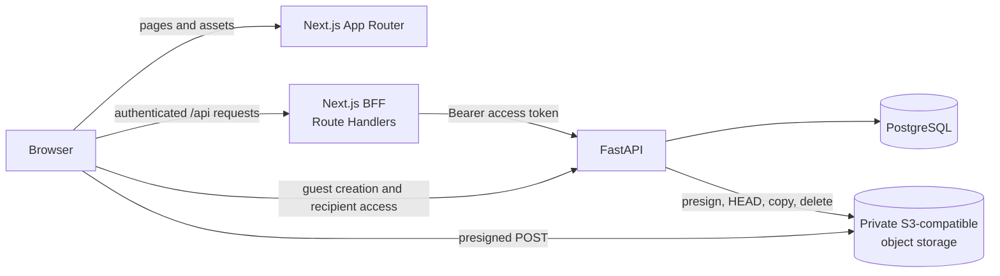
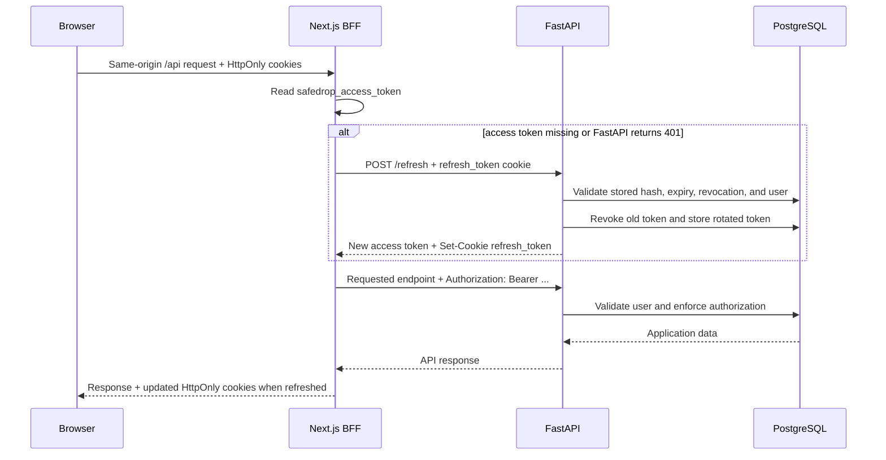
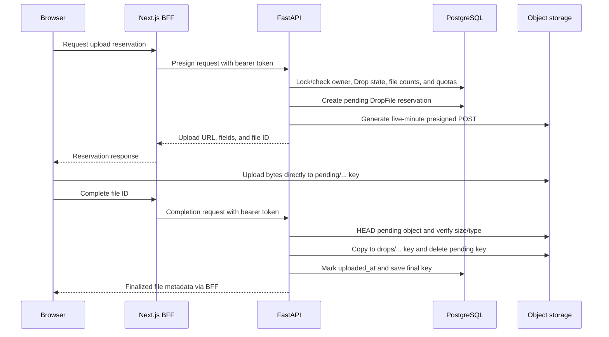
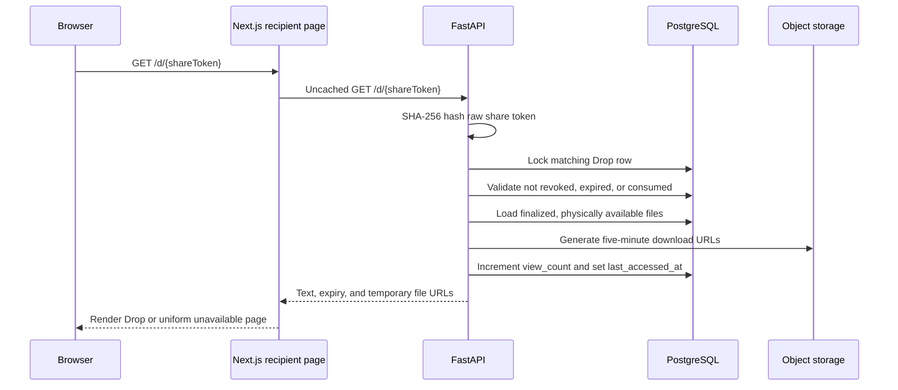

# Architecture

SafeDrop is a small monorepo with a Next.js frontend, a FastAPI backend, PostgreSQL persistence, and private S3-compatible object storage. The application deliberately separates account-facing browser traffic from public capability-link traffic.

## Repository boundaries

| Directory              | Responsibility                                                      |
| ---------------------- | ------------------------------------------------------------------- |
| `frontend/app`         | Next.js pages, layouts, and same-origin `/api/*` BFF Route Handlers |
| `frontend/components`  | Public, authenticated, admin, form, and shared UI                   |
| `frontend/hooks`       | TanStack Query keys, queries, mutations, and invalidation           |
| `frontend/lib`         | Browser API clients and server-only authentication/backend helpers  |
| `backend/app/routers`  | FastAPI HTTP endpoints                                              |
| `backend/app/models`   | SQLAlchemy persistence models                                       |
| `backend/app/schemas`  | Pydantic request and response contracts                             |
| `backend/app/services` | Object storage and storage-accounting operations                    |
| `backend/alembic`      | PostgreSQL schema migrations                                        |

## High-level system



The two backend URLs serve different consumers:

- `FASTAPI_URL` is server-only. Next.js Route Handlers use it to reach FastAPI.
- `NEXT_PUBLIC_API_URL` is browser-visible. Guest creation, guest file authorization, and recipient access use it directly; Server Components also use this client for recipient rendering.

Consequently, FastAPI CORS policy matters for public and guest browser requests, while authenticated application requests normally remain same-origin from the browser's perspective.

## Component responsibilities

### Next.js frontend

Next.js renders public and application pages, owns the application navigation and responsive design, and supplies the BFF Route Handlers. It does not make account authorization decisions on behalf of FastAPI.

The BFF:

- converts frontend login JSON into FastAPI's form-encoded login request;
- stores the access token in a Next-owned HttpOnly cookie;
- forwards FastAPI's HttpOnly refresh cookie;
- attaches access tokens as bearer credentials to authenticated FastAPI requests;
- performs one refresh-and-retry when a session can be recovered;
- rejects cross-site state-changing requests based on `Sec-Fetch-Site` and `Origin`; and
- normalizes backend responses without exposing access tokens to application JavaScript.

### FastAPI

FastAPI is the security and business-rule boundary. It validates credentials, resolves the current non-deleted user, checks the `admin` role, enforces ownership, hashes capability tokens, serializes view consumption and upload reservations, applies quotas, and generates storage signatures.

### PostgreSQL

PostgreSQL stores users, hashed refresh-token sessions, Drops, and Drop file metadata. Alembic owns schema evolution. The database is also used for row locks during recipient access and file-reservation/finalization paths.

### Object storage

The storage bucket holds file bytes privately. Database `DropFile` rows reserve names, types, sizes, quota, and object keys. FastAPI uses the S3 API to issue presigned POSTs and downloads, inspect uploaded objects, promote pending objects, and delete rejected objects.

## Authenticated API request



`frontend/proxy.ts` handles early navigation UX: it allows a fresh access cookie, redirects to the refresh Route Handler when a refresh cookie remains, and sends unauthenticated protected-page requests to login. Server layouts also guard admin pages. Neither layer replaces FastAPI's bearer-token and role checks.

## Frontend data strategy

Server Components remain the default page composition model. Interactivity, form state, and authenticated data caching live in Client Components.

Authenticated dashboard and admin data follow one path:

```text
Client Component -> TanStack Query -> Next.js /api Route Handler -> FastAPI
```

TanStack Query centralizes stable query keys, loading/error states, short-lived caching, pagination continuity, and mutation invalidation. Mutations update or invalidate affected Drop lists, details, user data, admin statistics, and storage usage.

Public pages may remain server rendered. The recipient page deliberately performs one uncached FastAPI request from a Server Component because a successful read consumes a view. Automatic retries and background refetching are avoided on that path.

## Direct file upload



Guest uploads omit the BFF authorization path: the browser sends `X-Guest-Management-Token` directly to FastAPI. The reservation, direct upload, verification, and promotion stages otherwise follow the same design.

The backend does not proxy upload bytes. This avoids tying application-worker memory and request duration to file size while preserving backend control over authorization and quotas.

## Recipient access



A successful request consumes exactly one view, even if the recipient refreshes the page. Unknown, revoked, expired, and consumed capabilities receive the same `404` response to reduce token-state disclosure.

## Trust and security boundaries

- Raw account passwords, access JWTs, refresh tokens, share tokens, and guest management tokens are capabilities or secrets and must not be logged or persisted unnecessarily.
- Passwords are stored as hashes. Refresh, share-lookup, and guest management tokens are stored as SHA-256 hashes.
- Account-owned share tokens are also encrypted with `DROP_ENCRYPTION_KEY` so an authenticated owner can recover the link. Guest share tokens are not recoverable through an owner endpoint.
- File storage is private, but application and infrastructure operators retain server-side access. SafeDrop is not E2EE or zero-knowledge.
- HTTPS is a deployment requirement; HttpOnly and `SameSite=Lax` do not encrypt traffic.

## Related documentation

- [Authentication](authentication.md)
- [Drops and sharing](drops-and-sharing.md)
- [File storage](file-storage.md)
- [Frontend](frontend.md)
- [Deployment](deployment.md)
