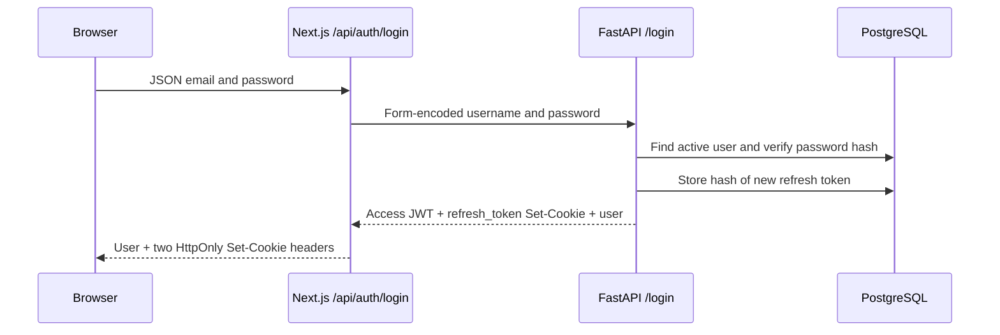

# Authentication

SafeDrop uses account sessions for registered users and separate capability tokens for guest workflows. The browser application places Next.js between account-facing JavaScript and FastAPI so access credentials are not stored in browser-accessible storage.

## Roles and registration

The only account roles are:

- `client` — normal registered user;
- `admin` — client capabilities plus platform statistics and user administration.

`POST /register` is public and always creates a user with the model's default `client` role. It does not accept a public role choice. Administrators can create either role through the protected user-management API.

Passwords must be 8–128 characters. The backend hashes them with `PasswordHash.recommended()` from `pwdlib`; password hashes are never returned by response schemas.

## Browser login flow

FastAPI's `/login` uses the OAuth2 password form convention: the email is submitted as `username`. The BFF accepts the frontend's JSON shape and performs that conversion.

FastAPI's raw authentication response contains an access token because it is also an OAuth2 bearer API. The SafeDrop browser BFF removes that token from its JSON response and exposes only user data while setting the token as an HttpOnly cookie.

## Cookies

| Cookie                  | Issuer/owner                  | Purpose                                                     | Relevant attributes                                                                            |
| ----------------------- | ----------------------------- | ----------------------------------------------------------- | ---------------------------------------------------------------------------------------------- |
| `safedrop_access_token` | Next.js                       | Short-lived JWT used by the BFF as a FastAPI bearer token   | HttpOnly, `SameSite=Lax`, path `/`, secure when `NODE_ENV=production`, expiry derived from JWT |
| `refresh_token`         | FastAPI, forwarded by Next.js | Opaque token for recovering and rotating an account session | HttpOnly, `SameSite=Lax`, path `/`, expiry set by FastAPI, secure when `COOKIE_SECURE=true`    |

Application JavaScript cannot read either cookie. The access token is not stored in `localStorage` or `sessionStorage`.

`HttpOnly` reduces exposure to injected JavaScript but is not transport encryption. Production requires HTTPS and secure-cookie settings. Keep FastAPI's `COOKIE_SECURE` and the Next.js production environment aligned.

## Access JWTs

FastAPI signs access JWTs using `JWT_SECRET` and `JWT_ALGORITHM`. The payload contains:

- `sub` — user UUID;
- `type` — role at issue time;
- `exp` — access-token expiry.

For each authenticated request, FastAPI verifies the signature and expiry, parses `sub`, and loads a non-deleted user from PostgreSQL. Authorization uses the current database user, including the current role; it does not trust frontend state as the final authority.

## Refresh-token persistence and rotation

Refresh tokens are opaque random values. The browser receives the raw token only as an HttpOnly cookie. PostgreSQL stores a SHA-256 hash in `auth.refresh_tokens` together with the user ID, expiry, creation time, and optional revocation time.

On a valid `POST /refresh`:

1. FastAPI hashes the supplied cookie and finds an unrevoked, unexpired row.
2. It verifies that the associated user still exists and is not soft deleted.
3. It revokes the old row.
4. It creates and stores a new token hash.
5. It issues a new access JWT and refresh cookie.

Rotation preserves the original refresh session's absolute expiration. Repeated refreshes therefore do not extend the original session indefinitely.

## Access-token recovery

`frontend/lib/server/session.ts` handles recovery for authenticated BFF calls:

- if the access cookie is missing but a refresh cookie exists, it refreshes before making the requested call;
- if FastAPI rejects an access token with `401`, it refreshes once and retries once;
- concurrent server refreshes for the same raw refresh token share one in-flight promise; and
- an unrecoverable session causes the BFF to clear both cookies.

`frontend/proxy.ts` applies similar routing UX to page navigation. For `GET` and `HEAD` requests, it checks protected paths (`/dashboard`, `/profile`, and `/admin`), accepts an access token that is not within 15 seconds of expiry, and redirects through `/api/auth/refresh` when only a usable refresh cookie remains.

The proxy improves navigation and avoids showing protected screens to an obviously unauthenticated browser. It does not validate JWT signatures and is not the security boundary. FastAPI validates the bearer token for every protected API operation, and the admin dependency loads the user and requires the current database role to be `admin`.

The admin layout also calls a server-side role guard for routing UX. Again, FastAPI independently enforces admin-only endpoints.

## Logout and account deletion

The Next.js logout Route Handler forwards the refresh cookie to `POST /logout`. FastAPI marks the matching refresh-token row revoked and deletes its cookie; Next.js then clears both browser cookies even if backend confirmation fails.

Administrators soft-delete other users by setting `deleted_at`. That operation also revokes all of the deleted user's active refresh-token rows. A deleted user cannot log in or resolve as the current bearer-token user.

## Cross-origin mutation checks

Next.js BFF handlers reject state-changing requests when `Sec-Fetch-Site` is `cross-site` or an `Origin` header differs from the BFF origin. This complements `SameSite=Lax` cookies. FastAPI CORS configuration still governs browser requests that directly target FastAPI, such as guest operations.

## Guest capabilities are not account sessions

Guest creators do not register, log in, receive JWTs, or receive refresh sessions. Guest Drop creation returns two raw capabilities:

- the share token lets a recipient consume the Drop;
- the management token authorizes the guest file reservation and completion endpoints through `X-Guest-Management-Token`.

The database stores only hashes of these guest capabilities. The management token is not an account credential and currently does not provide dashboard, edit, or revoke functionality. See [Drops and sharing](drops-and-sharing.md).

## Security limits

SafeDrop's account architecture protects credentials from ordinary browser JavaScript and applies server-side authorization. It does not make Drop content end-to-end encrypted. Drop text remains available to the backend and database operators, and file objects remain accessible to sufficiently privileged storage operators.
