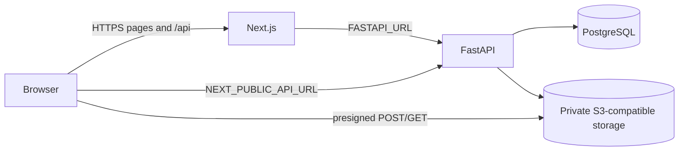

# Deployment

SafeDrop has no checked-in provider deployment manifest. The repository contains a Neon project configuration for object-storage preview resources and branch policy, but production can use any compatible services that satisfy the requirements below.

## Required services

- A Node.js runtime for the Next.js server; static-only hosting is insufficient because the application uses Route Handlers, server authentication helpers, and Server Components.
- A Python runtime for FastAPI.
- PostgreSQL reachable by FastAPI and Alembic.
- A private S3-compatible object-storage bucket reachable by FastAPI and directly reachable by browsers for signed transfers.
- HTTPS endpoints for the frontend and FastAPI.

## Build and start

Frontend build:

```bash
pnpm install --frozen-lockfile
pnpm --dir frontend build
pnpm --dir frontend start
```

Backend install and start from `backend`:

```bash
python -m pip install -r requirements.txt
python -m uvicorn app.main:app --host 0.0.0.0 --port 8000
```

Run database migrations as a release step before serving code that depends on them:

```bash
cd backend
python -m alembic upgrade head
```

Use your platform's process manager, health checks, secret store, network policy, and rollout mechanism. Do not run Uvicorn with `--reload` in production.

## Frontend variables

| Variable              | Exposure            | Production requirement                                              |
| --------------------- | ------------------- | ------------------------------------------------------------------- |
| `FASTAPI_URL`         | Next.js server only | Base URL reachable from the Next.js runtime, with no trailing slash |
| `NEXT_PUBLIC_API_URL` | Browser-visible     | HTTPS FastAPI base URL reachable by users' browsers                 |
| `NODE_ENV`            | Runtime/build       | `production` makes the Next-owned access cookie secure              |

`FASTAPI_URL` may be an internal service URL. `NEXT_PUBLIC_API_URL` cannot be internal because guest creation, guest file authorization, and recipient access use it directly. Treat `NEXT_PUBLIC_*` values as public configuration, never as secrets.

## Backend variables

| Variable                      | Purpose                                                                                |
| ----------------------------- | -------------------------------------------------------------------------------------- |
| `DATABASE_URL`                | Production PostgreSQL connection string                                                |
| `TEST_DATABASE_URL`           | Separate test database; currently required by settings even when tests are not running |
| `JWT_SECRET`                  | Access JWT signing secret                                                              |
| `JWT_ALGORITHM`               | Allowed JWT signing algorithm                                                          |
| `ACCESS_TOKEN_EXPIRE_MINUTES` | Access-token lifetime                                                                  |
| `REFRESH_TOKEN_EXPIRE_DAYS`   | Absolute refresh-session lifetime                                                      |
| `COOKIE_SECURE`               | Whether FastAPI marks the refresh cookie secure; set `true` with HTTPS                 |
| `DROP_ENCRYPTION_KEY`         | Fernet key for account-owned share-token recovery                                      |
| `STORAGE_BUCKET`              | Production private bucket name                                                         |
| `AWS_ACCESS_KEY_ID`           | S3-compatible credential ID                                                            |
| `AWS_SECRET_ACCESS_KEY`       | S3-compatible credential secret                                                        |
| `AWS_ENDPOINT_URL_S3`         | S3-compatible endpoint                                                                 |
| `AWS_REGION`                  | Storage region                                                                         |

`TEST_STORAGE_BUCKET`, `TEST_AWS_ACCESS_KEY_ID`, `TEST_AWS_SECRET_ACCESS_KEY`, `TEST_AWS_ENDPOINT_URL_S3`, and `TEST_AWS_REGION` are optional application settings used by real storage integration tests. Do not deploy production credentials in these variables or run integration tests against production resources.

Store `DATABASE_URL`, JWT and Fernet keys, and storage credentials in a platform secret manager. Never embed them in frontend variables or commit them.

Keep `DROP_ENCRYPTION_KEY` stable across deployments. Losing or rotating it without data migration prevents owners from recovering existing encrypted share tokens. Changing `JWT_SECRET` invalidates outstanding access tokens; stored refresh sessions may then mint tokens under the new secret if they remain valid.

## Network and URL configuration



The Next.js server must be able to resolve and reach `FASTAPI_URL`. Browsers must be able to resolve `NEXT_PUBLIC_API_URL` and the host embedded in presigned storage URLs.

Configure the storage service's CORS policy to allow presigned POST uploads from the frontend origin and any required download behavior. Keep the bucket private; presigned requests provide narrow temporary access.

## FastAPI CORS

The current FastAPI middleware allows credentials only from:

```text
http://localhost:3000
http://127.0.0.1:3000
```

A production frontend origin is not currently allowed. Before production deployment, update or parameterize `allow_origins` to include the exact HTTPS frontend origin. Do not use a wildcard together with credentialed requests. This is required for browser-direct guest and recipient API calls even though authenticated BFF calls are server-to-server.

If public and server-facing FastAPI hosts differ, both must route to the same application and data stores, and generated storage URLs must remain browser-reachable.

## Cookies and HTTPS

Production should use HTTPS end to end and set:

```dotenv
COOKIE_SECURE=true
```

Next.js automatically sets `Secure` on `safedrop_access_token` when `NODE_ENV=production`. FastAPI controls `Secure` for `refresh_token` through `COOKIE_SECURE`. Both cookies are HttpOnly, `SameSite=Lax`, and scoped to `/`.

Next.js forwards FastAPI's refresh `Set-Cookie` header to the frontend response. Confirm in the deployed topology that both cookies are set for the frontend host and survive login, refresh, and logout. If a reverse proxy terminates TLS, preserve the external HTTPS scheme and cookie headers correctly.

The BFF rejects cross-origin mutations, but HTTPS, exact CORS origins, `SameSite`, and backend authorization all remain necessary layers.

Before production, remove or disable the current diagnostic `console.log` in `frontend/app/api/auth/login/route.ts`. It prints FastAPI's forwarded `Set-Cookie` header and can therefore place the raw refresh token in server logs.

## Database

- Use PostgreSQL; the models use schemas, PostgreSQL-compatible UUIDs, and Alembic migrations.
- Require encrypted database connections according to the provider's connection-string options.
- Run `python -m alembic upgrade head` with the production `DATABASE_URL` during deployment.
- Back up the database and test restoration; Drop metadata, token hashes, encrypted owner tokens, refresh sessions, and file accounting live there.
- Do not run the pytest suite against production because its fixtures create and drop tables and schemas.

## Object storage operations

FastAPI needs permission to generate signed requests and perform `HEAD`, copy, and delete operations in the configured bucket. The browser uploads into `pending/` and finalized objects live under `drops/`.

No automated cleanup worker is implemented. Production operations must add a reviewed process for abandoned pending reservations and terminal Drop files, coordinating object deletion with `storage_deleted_at`. Without that process, physical usage continues growing and the 1 GiB platform limit continues counting those rows.

## Health and observability

- `/health` verifies the FastAPI process.
- `/health/db` verifies a database round trip and returns `503` on SQLAlchemy connectivity failure.
- The root development command waits on `/health`, not `/health/db`.

Choose the appropriate endpoint for platform probes. Avoid logging credentials, raw capability URLs, bearer tokens, refresh cookies, or presigned storage URLs. Add production telemetry and retention policies through deployment configuration rather than exposing sensitive request data.

## Pre-deployment checklist

- [ ] Frontend and backend production builds/checks pass.
- [ ] Alembic is at the repository head.
- [ ] `FASTAPI_URL` works from the Next.js runtime.
- [ ] `NEXT_PUBLIC_API_URL` works from an external browser.
- [ ] FastAPI CORS includes the exact frontend HTTPS origin.
- [ ] Access and refresh cookies are HttpOnly and Secure.
- [ ] PostgreSQL and object storage use production credentials and transport security.
- [ ] The bucket is private and its CORS policy permits intended signed transfers only.
- [ ] Database backups and a physical object cleanup process exist.
- [ ] Health checks, logs, and alerts do not expose tokens or signed URLs.
